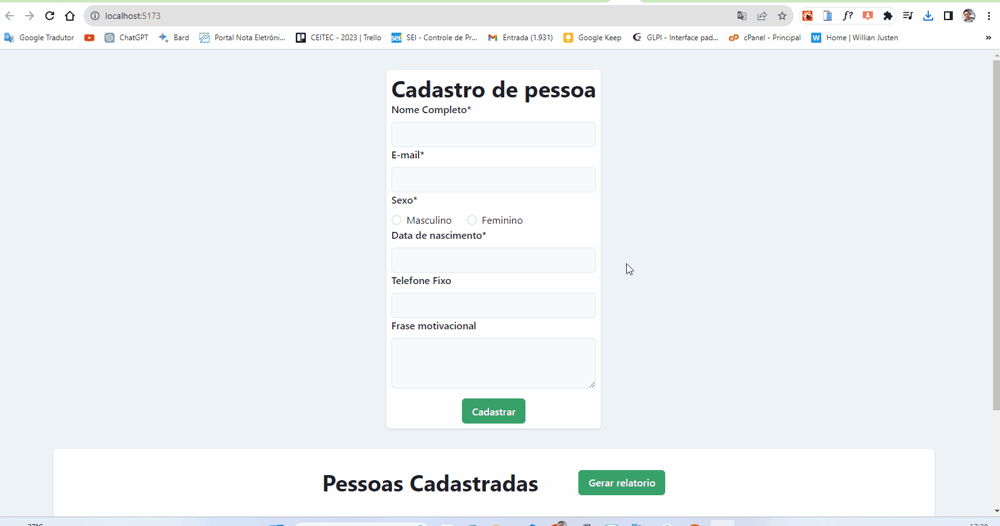

# Aplicação de Cadastro de Pessoas

Esta é uma aplicação de cadastro de pessoas desenvolvida utilizando as tecnologias React, Vite, Next.js, Axios, Node.js e a biblioteca Chakra UI.

## Funcionalidades

- Cadastro de novas pessoas com informações como nome, idade, endereço, etc.
- Listagem de todas as pessoas cadastradas.
- Edição e exclusão de informações de pessoas cadastradas.

## Tecnologias Utilizadas

- **React:** Biblioteca JavaScript de código aberto para construção de interfaces de usuário.
- **Vite:** Build tool e bundler ultra-rápido para aplicações JavaScript.
- **Next.js:** Framework React com funcionalidades avançadas como renderização do lado do servidor (SSR) e renderização do lado do cliente (CSR).
- **Axios:** Cliente HTTP baseado em Promises para fazer requisições à API.
- **Node.js:** Ambiente de tempo de execução JavaScript do lado do servidor.
- **Chakra UI:** Biblioteca de design de componentes simples e modularizados para React.

## Configuração

1. Certifique-se de ter o Node.js instalado. Você pode baixá-lo em** https://nodejs.org/**.
2. Clone este repositório para sua máquina local.
3. Navegue até o diretório do projeto no terminal.

## Configurando o Backend (Node.js)

1. Navegue até o diretório **"backend"** no terminal.
2. Execute o comando **"npm install"** para instalar as dependências do backend.
3. Renomeie o arquivo **".env.example"** para **".env"** e configure as variáveis de ambiente, como as configurações do banco de dados.
4. Execute o comando **"npm start"** para iniciar o servidor backend.

## Configurando o Frontend (React, Vite, Next.js)

1. Navegue até o diretório **"frontend"** no terminal.
2. Execute o comando **"npm install"** para instalar as dependências do frontend.
3. Renomeie o arquivo **".env.example"** para **".env.local"** e configure as variáveis de ambiente, como a URL da API backend.
4. Execute o comando **"npm run dev"** para iniciar o servidor de desenvolvimento do frontend.

Acesse a aplicação em seu navegador através de **http://localhost:3000.**

## Contribuição

Se você quiser contribuir para este projeto, fique à vontade para criar um fork, fazer as alterações e enviar um pull request. Ficaremos felizes em revisar e mesclar suas contribuições!

## Licença

Este projeto está licenciado sob a **MIT License**.

---

Feito com ❤️ e tecnologias open-source.
